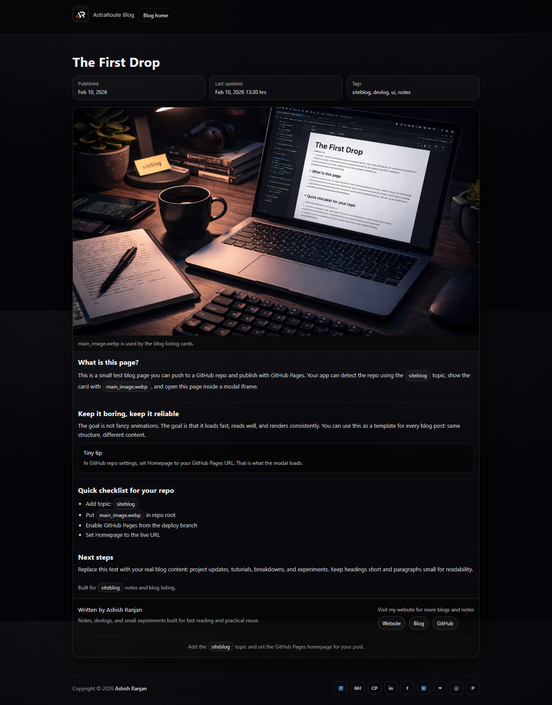

# Siteblog Test Blog

A concise static blog post template for GitHub Pages. It demonstrates a readable article layout, repository checklist, author section, local hero image, and metadata that a siteblog listing can reuse.

## Features

- Fixed branded header with local project logo
- Readable article layout with hero image, metadata, chips, callout, and author section
- Responsive design with icon-only social and support footer links
- Dynamic copyright year and floating go-to-top control
- No build step required for local use

## Tech stack

- HTML, CSS, and vanilla JavaScript
- Local image assets and GitHub Pages deployment

## Run locally

Open `index.html` in a browser or use any static local server.

## Deployment

Live app: [https://a2rp.github.io/siteblog-test-blog/](https://a2rp.github.io/siteblog-test-blog/)

## Links

- Portfolio: [https://www.ashishranjan.net/](https://www.ashishranjan.net/)
- GitHub: [https://github.com/a2rp](https://github.com/a2rp)
- CodePen: [https://codepen.io/ash1198](https://codepen.io/ash1198)
- LinkedIn: [https://www.linkedin.com/in/aashishranjan](https://www.linkedin.com/in/aashishranjan)
- Facebook: [https://www.facebook.com/theash.ashish/](https://www.facebook.com/theash.ashish/)
- YouTube: [https://www.youtube.com/@ashishranjan-ashz?sub_confirmation=1](https://www.youtube.com/@ashishranjan-ashz?sub_confirmation=1)
- Email: [ash.ranjan09@gmail.com](mailto:ash.ranjan09@gmail.com)

## Support

- Support: [https://a2rp-donation-page.netlify.app/](https://a2rp-donation-page.netlify.app/)
- Buy Me a Coffee: [https://buymeacoffee.com/a2rp](https://buymeacoffee.com/a2rp)
- Patreon: [https://patreon.com/a2rp](https://patreon.com/a2rp)